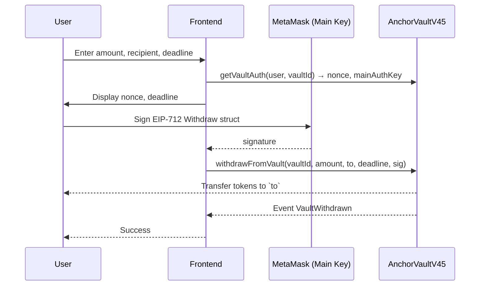

# AnchorVaultV45

Non-custodial, multi-asset ERC-20 vault with EIP-712 off-chain authorization.

## Overview

AnchorVaultV45 lets a user lock 18-decimal ERC-20 tokens into a personal **vault** controlled by **two user-held authorization keys**:

- **Main key** — authorizes everyday operations (withdraw, transfer, set locks).
- **Recovery key** — authorizes emergency operations (recover, emergency withdraw, rotate keys, early close). This is the most powerful credential.

Every state-changing user operation is authorized by an **EIP-712 signature** from the appropriate key, and `msg.sender` must also be the vault owner — a 2-factor design (wallet account + signing key). Replay is prevented by a per-vault `nonce`, a `deadline`, and the EIP-712 domain (chainId + contract address).

## Sequence Diagram

The diagram below shows the flow of a typical withdraw operation authorized by the **main key**.



Similar flows exist for `transferVault` (quick transfer), `initSecureTransfer`/`confirmSecureTransfer` (escrow), `setTimelock`, `setVoluntaryLock`, `rotateAuthKeys`, and emergency operations (`earlyClose`, `recoverToSafe`, `emergencyWithdrawToAny`, `panicWithdraw`).

## Invariants (Critical Guarantees)

The contract enforces the following invariants. Auditors should verify these hold under all conditions.

- **Principal integrity:** `lockedPrincipal[token]` is always equal to the sum of `v.amount` of all active vaults for that token. No user action can transfer principal out of the contract without decreasing `lockedPrincipal` by the exact amount.

- **User solvency:** For every vault, `v.amount` is always less than or equal to the contract's balance of that token minus all other vaults' locked amounts. A user can always withdraw their full vault balance — withdrawals remain available even when the contract is paused (non-custodial guarantee).

- **Nonce monotonicity:** Each vault's `nonce` increases strictly by 1 only after a successful operation that consumes a valid signature. Failed or invalid signatures do not change the nonce. The nonce never decreases.

- **Role separation:** `creator` and `guardian` cannot be the same address. `creator` cannot withdraw user principal; `guardian` cannot unpause the contract. Role transfers require a two-step handshake with a cooldown.

- **Emergency address immutability (first set):** Once a user sets `globalEmergency`, it cannot be changed immediately; a 7-day timelock is required for any change, and the user can cancel the pending change. This prevents an attacker from redirecting emergency funds instantly.

> **Automated verification:** the two accounting invariants above (principal integrity and user solvency) are continuously checked by a Foundry **invariant test suite** — `test/AnchorVaultInvariant_t.sol`. It fuzzes random sequences of open / deposit / withdraw / early-close and asserts after every step that the contract is never insolvent (`balance ≥ lockedPrincipal + creatorFees + strategicReserve + rewardPool`) and that `lockedPrincipal` always matches the live vault amount. Full test suite: **314 passing, 0 failing**.

## Known Risks & Accepted Design Decisions

The following design choices are intentional. Auditors should note them as accepted trade-offs, not vulnerabilities.

- **EIP-712 domain separation:** The contract relies on the EIP-712 domain (chainId, contract address, name, version) to prevent cross-chain replay. If the same domain appeared on another chain, signatures could be replayed; that is considered unlikely.

- **Nonce overflow:** `nonce` is stored as `uint64`. The contract **explicitly checks for overflow** — `if (v.nonce == type(uint64).max) revert NonceOverflow();` is evaluated **before** the increment, and only the `+= 1` itself runs inside an `unchecked` block. Reaching the `uint64` maximum (~1.8e19) would require billions of operations on a single vault and is infeasible; the explicit check is a defensive backstop.

- **voluntaryLockUntil vs. emergency functions:** `recoverToSafe`, `emergencyWithdrawToAny` and `rotateAuthKeys` ignore `voluntaryLockUntil` — they call the shared `_checkSig(..., enforceLock = false)`. `earlyClose` respects the lock — it calls `_checkSig(..., enforceLock = true)`. `panicWithdraw` carries **no signature at all** and therefore also bypasses the lock by design. This is intentional: emergency exits must remain possible even when the user has set a voluntary lock.

- **Deadline timestamps:** `block.timestamp` is used for deadlines, timelocks, and cooldowns. Validators can manipulate `block.timestamp` within a few seconds, but all intervals are measured in hours or days, so a few seconds of drift does not affect security. This is standard practice.

- **Penalty distribution on pause:** When the contract is paused:
  - For **ANCR**, the entire penalty (100%) goes to `rewardPool`. The 20% burn, 25% creator, and 20% reserve shares from normal mode are all redirected to the reward pool — no tokens are burned or allocated to creator/reserve during pause.
  - For **other tokens**, penalties are split 50/50 between `creatorFees` and `strategicReserve` (same as normal mode); no reward-pool allocation occurs.

  This prevents the creator from profiting from forced pauses while still accumulating reserve for non-ANCR tokens.

## EIP-712 Signature Example (Withdraw)

To withdraw from a vault, the user must sign the following typed-data structure using their **main key** (the wallet address stored as `mainAuthKey` in the vault).

Domain separator (automatically derived by the contract; example values for Sepolia):

```json
{
  "name": "AnchorVault",
  "version": "45",
  "chainId": 11155111,
  "verifyingContract": "0x8E1F46fC913c4928303BbCEB92ccb7c54cD95BA4"
}
```

Message (Withdraw):

```json
{
  "owner": "0x725F1408c2CDa5757d8B44a92a84EACc529F5150",
  "vaultId": "1",
  "amount": "10000000000000000000",
  "to": "0x725F1408c2CDa5757d8B44a92a84EACc529F5150",
  "nonce": "0",
  "deadline": "1749600000"
}
```

Types:

```json
{
  "Withdraw": [
    { "name": "owner", "type": "address" },
    { "name": "vaultId", "type": "uint256" },
    { "name": "amount", "type": "uint256" },
    { "name": "to", "type": "address" },
    { "name": "nonce", "type": "uint64" },
    { "name": "deadline", "type": "uint256" }
  ]
}
```

The frontend obtains the current nonce via `getVaultAuth(user, vaultId)`, computes the typed-data hash, and requests the user's wallet (which holds the main key) to sign it. The resulting signature is passed as the last argument to `withdrawFromVault`.

Similar structures exist for `TransferVault`, `InitSecureTransfer`, `SetTimelock`, `SetVoluntaryLock`, `RotateAuthKeys`, `EarlyClose`, `RecoverToSafe`, `EmergencyWithdraw`.

## Vault levels

| Level | Deposit fee | Max timelock |
|---|---|---|
| SAFE | 0.50 % | 0 h |
| VAULT | 1.50 % | 72 h |
| FORTRESS | 2.00 % | 168 h |

## Fees & penalties

| Operation | Fee |
|---|---|
| Open vault | 0.20 % |
| Withdraw / Transfer / Secure transfer | 0.50 % |
| Early close | 5 % |
| Recover to safe | 10 % |
| Emergency withdraw to any | 15 % |
| Panic withdraw | 20 % |

**Penalty distribution**

- **ANCR:** 20 % burned, 25 % creator fees, 20 % strategic reserve, 35 % reward pool.
- **Other tokens:** 50 % creator fees, 50 % strategic reserve (no burn, no reward pool).
- **While paused:** ANCR → 100 % reward pool; other tokens → 50 / 50 creator / reserve.

## Roles & trust

- **creator** (deployer): withdraws accrued creator fees and strategic reserve (each behind a 7-day timelock), sets the welcome bonus, adds/removes supported tokens, unpauses, transfers roles (2-step, cooldown). **Cannot touch user principal.**
- **guardian:** pauses the contract (2-day delayed pause, or immediate `emergencyPause`). Cannot unpause and cannot move funds.

Role transfers are two-step with cooldowns; `creator` and `guardian` must differ.

## Key mechanisms

- **Global emergency address** (per user, EOA only): first set is immediate; changing it needs a 7-day timelock (propose → confirm → can cancel). Recovery operations route here.
- **Quick transfer** (`transferVault`): one-step move of a vault to another user.
- **Secure transfer** (`initSecureTransfer` → `confirmSecureTransfer`): two-step escrow with a 48 h window; sender can cancel/reclaim, recipient can reject.
- **Voluntary lock:** a hard, time-bounded lock (≤ 5 years) blocking main-key operations. Can only be extended.
- **Timelock** (`timelockHours`): a soft, owner-set withdrawal cooldown, measured from vault creation.
- **Pause:** stops new deposits/transfers; withdrawals of user funds stay available (non-custodial guarantee).

## Build

- Solidity 0.8.26
- OpenZeppelin Contracts 5.6.1
- Settings: `via_ir = true`, `optimizer = true`, `optimizer_runs = 1`, `evm_version = cancun`
- Runtime size: 24,458 / 24,576 bytes (EIP-170)

```bash
forge install OpenZeppelin/openzeppelin-contracts@v5.6.1
forge install foundry-rs/forge-std
forge build
forge test
```

Deploy (constructor args via env, no secrets in repo):

```bash
ANCR_TOKEN=0x... GUARDIAN=0x... PAYOUT_WALLET=0x... \
forge script script/Deploy.s.sol --rpc-url $SEPOLIA_RPC --broadcast --verify
```

## Size Monitoring

The contract is very close to the EIP-170 limit of 24,576 bytes. Size is monitored with:

```bash
forge build --sizes | grep AnchorVaultV45
```

Current size is **24,458 bytes (118 bytes spare)**. The compiler settings (`via_ir`, `optimizer_runs = 1`) are tuned for minimal bytecode size. Any future change must be accompanied by a size check to ensure the limit is not exceeded.

## Audit scope

- **In scope:** `src/AnchorVaultV45.sol`
- **Out of scope:** OpenZeppelin libraries (`IERC20`, `SafeERC20`, `IERC20Metadata`, `ReentrancyGuard`, `EIP712`, `ECDSA`).

See `SECURITY.md` for the threat model, centralization summary, accounting invariant, and accepted design decisions.

## Deployment (Sepolia testnet, chainId 11155111)

- **AnchorVaultV45:** `0x8E1F46fC913c4928303BbCEB92ccb7c54cD95BA4`
- **ANCR token (AnchorCoin):** `0x6a837125eeB63cc4D3d38E93e2adCd30a2603cF7`
- **creator:** `0x725F1408c2CDa5757d8B44a92a84EACc529F5150`
- **guardian:** `0x0838238A55d846A2a92fC6889Cc96558533B68ab`
- **payout wallet:** `0x725F1408c2CDa5757d8B44a92a84EACc529F5150`

> **Centralization note:** in this testnet deployment, `payoutWallet` equals the `creator` address (`0x725F…5150`). This means the 200,000 ANCR payout share and all accrued creator/reserve withdrawals route to the same EOA. Acceptable on testnet. **For mainnet, separate `payoutWallet` from `creator`, and ideally make `creator` a multisig** to remove this single-key centralization point.

**Build settings (must match for bytecode verification):** `solc 0.8.26`, `optimizer_runs = 1`, `via_ir = true`, `evm_version = "cancun"`, `bytecode_hash = "none"`.

**Token distribution initialized:** 500,000 ANCR `rewardPool` + 300,000 ANCR `strategicReserve` held in the vault, 200,000 ANCR sent to the payout wallet.

## License

BUSL-1.1 — Licensor: Vitaliy — Copyright (c) 2026 AnchorVaultCoin.
Change Date 2030-01-01 → GPL-2.0-or-later. Imported OpenZeppelin files are MIT.
Commercial use before the Change Date requires written permission from the Licensor.
